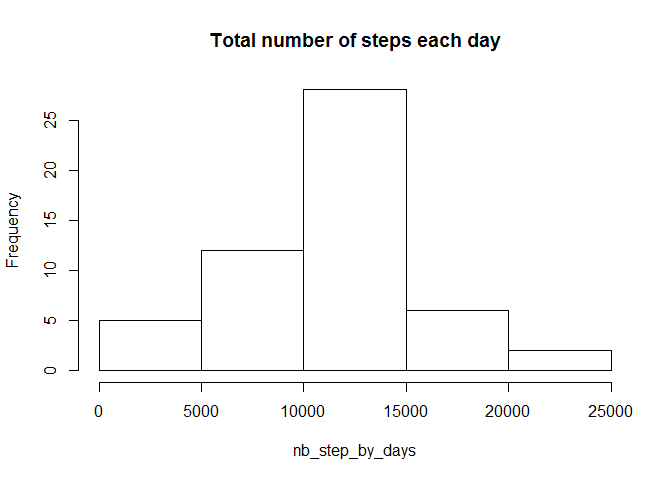
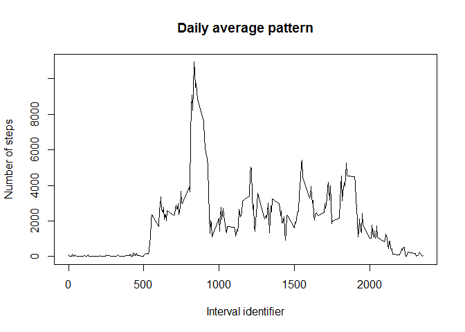
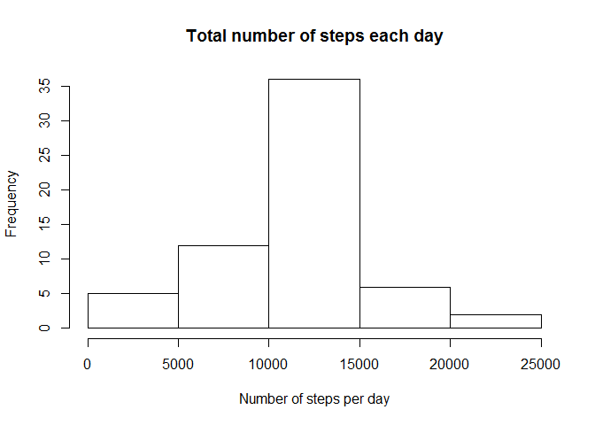
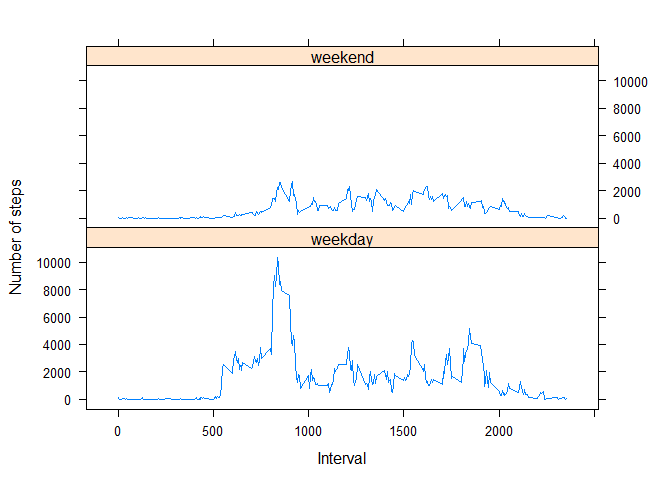

# Reproducible Research: Peer Assessment 1


## Loading and preprocessing the data


```r
unzip("activity.zip")
data_activity <- read.csv("activity.csv")
```


## What is mean total number of steps taken per day?

### Histogram of the total number of steps taken each day


```r
nb_step_by_days <- tapply(data_activity$steps,data_activity$date,sum)
hist(nb_step_by_days, main = "Total number of steps each day")
```

<!-- -->

### Mean and median number of steps taken each day


```r
options(scipen = 2)
s_step_day <- summary(nb_step_by_days)
mean_step_day <- s_step_day["Mean"]
median_step_day <- s_step_day["Median"]
```
The mean of the number of steps taken each day is 10770 and the median is 10760.


## What is the average daily activity pattern?

### Time series plot of the average number of steps taken


```r
steps_by_interval <- with(data_activity, tapply(steps,interval,function(x) sum(x,na.rm = TRUE)))
plot(names(steps_by_interval), steps_by_interval, main = "Daily average pattern", type ="l", ylab = "Number of steps", xlab = "Interval identifier")
```

<!-- -->

### The 5-minute interval that, on average, contains the maximum number of steps

The 5-minute interval that, on average, contains the maximum number of steps is 835.

## Imputing missing values

### Strategy for imputing missing data

There are 2304 missing values.

These missing values are replaced with the average value over the 5 min interval.


```r
mean_steps_by_interval <- tapply(data_activity$steps,data_activity$interval,function(x) mean(x,na.rm = TRUE))

steps_missing <- is.na(data_activity$steps)
data_activity[steps_missing, "steps"] <- mean_steps_by_interval[as.character(data_activity[steps_missing, "interval"])]
```

### Histogram of the total number of steps taken each day after missing values are imputed.


```r
nb_step_by_days_narm <- tapply(data_activity$steps,data_activity$date,sum)
hist(nb_step_by_days_narm, main = "Total number of steps each day", xlab = "Number of steps per day")
```

<!-- -->

### Mean and medain number of steps taken each day once N.A. are replaced.


```r
options(scipen = 2)
s_step_day_narm <- summary(nb_step_by_days_narm)
mean_step_day_narm <- s_step_day_narm["Mean"]
median_step_day_narm <- s_step_day_narm["Median"]
```
The mean of the number of steps taken each day is 10770 and the median is 10770. Only the value for the median slightly differs with the value computed with NA(mean: 10770, median: 10760).


## Are there differences in activity patterns between weekdays and weekends?


Create factor with two levels weekday and weekend.


```r
wdays <- strptime(data_activity$date, format ="%Y-%m-%d")$wday %in% c(0,6)
wdays <- as.factor(wdays)
levels(wdays) <- c("weekday", "weekend")

data_activity <- cbind(data_activity, "days" = wdays)
```

Create panel plot.


```r
library(reshape2)
```

```
## Warning: package 'reshape2' was built under R version 3.2.5
```

```r
steps_by_interval_w <- with(data_activity, tapply(steps,list(days,interval),sum))
steps_by_interval_wl <- melt(steps_by_interval_w, varnames = c("day","interval"))

library(lattice)
```

```
## Warning: package 'lattice' was built under R version 3.2.5
```

```r
xyplot(value ~ interval|day, steps_by_interval_wl, layout = c(1,2), type = "l", xlab = "Interval", ylab = "Number of steps")
```

<!-- -->
